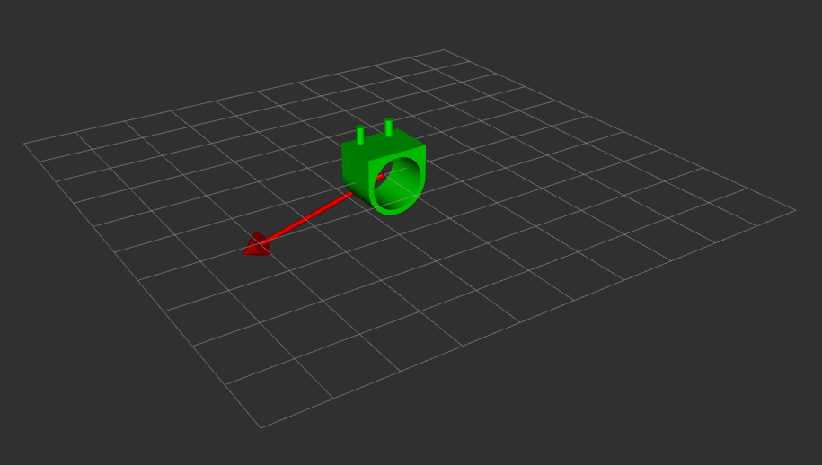
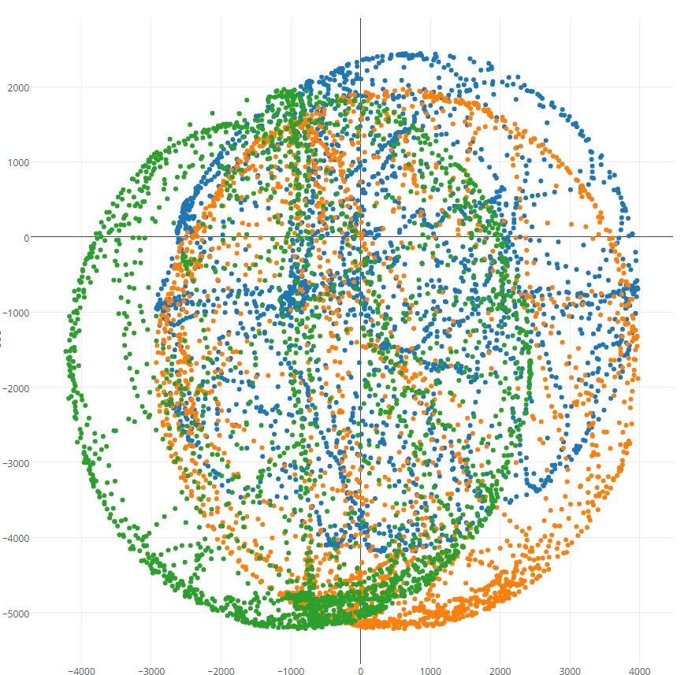
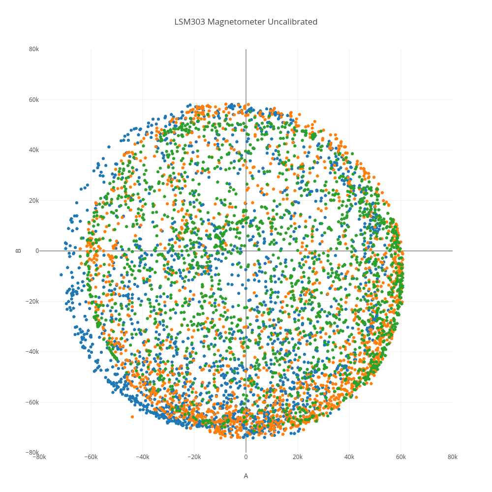
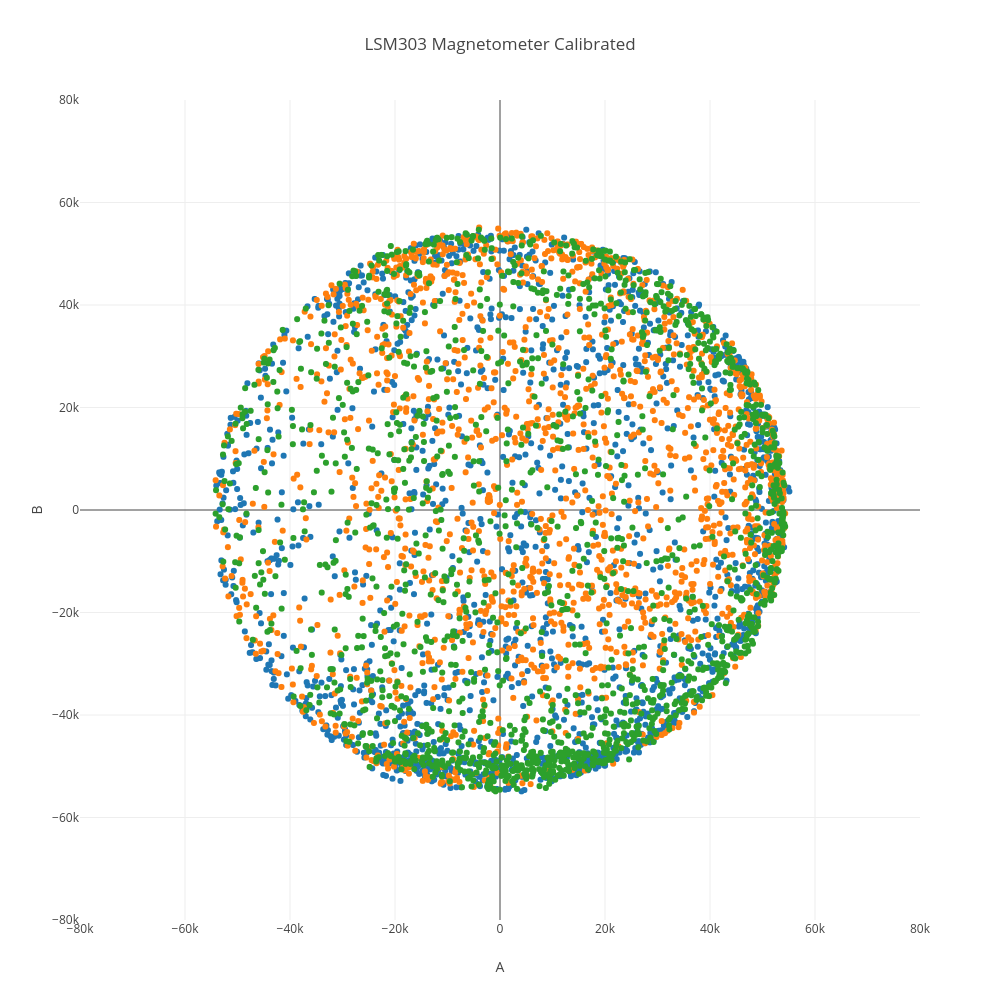

## Overview

|Components                     |Concepts|
|:-----------------------------:|:----:|
|    MPU-9250 9-Axis IMU     |ROS|
|    DRV-2605L Haptic Driver  |    Embedded Microprocessors  |
|    BOB-12009 Logic Level Converter      |    I2C and Serial Communications  |
|    Redboard Arduino       |    IMU operation  |
|                               |    Drivers and Vibrotactors  |
||    Python  |  Soldering  |
||  3D Modeling and Printing  |

## Summary

This wearable device detects magnetic fields around it and communicates their strength to the user through tactile feedback. In visualization mode it also displays the orientation of the sensor and the directionality of the magnetic field relative to itself on a connected computer display.  

{: height="170px" width="300px"}

This project was primarily a break-in exercise for my interest in portable and wearable sensing devices. Use cases are mostly limited to curiosity, although practical applications do exist.  

Electrical currents and operating appliances generate magnetic fields, for example, so the wearable provides knowledge about the state of electrical circuits and equipment that doesn't rely on the equipment itself. This would be useful in situations where the equipment's own feedback is unreliable, unfamiliar, or inaccessible. Such situations might include the design and repair of heavy machinery, disaster response in urban areas, or operations near high-power equipment in atypical environments like underwater power lines or space stations.  

{: height="135px" width="300px"}

To build on this potential applicability the wearable uses vibration instead of a visual or audio cue. This allows the device to communicate with the user through a sensory channel less saturated than sight or hearing, and in a way that will demand less of their focus to process.

When large magnetic fields are not a matter of concern, the device has some utility for navigation and orientation as well, since it can be used as a compass in visualization mode.  

The project consists of several ROS nodes written in Python [here](https://github.com/idtx314/rosglove) and C like code running on an Arduino microcontroller [here](https://github.com/idtx314/gloveduino).

## Implementation Summary
The project was built on a Sparkfun Redboard arduino variant connected by USB cable to a Linux laptop computer running Ubuntu 16.04. The Redboard and the laptop use Serial communication over the USB line, while the Redboard communicates with the MPU-9250 and DRV-2605L using the I2C protocol. The hardware prototype is mounted on 3D printed parts and worn on the fingers and forearm using velcro straps.

The code running on the Redboard relies on the libraries distributed with the driver board and IMU for ease of use, segueing into lower level interactions with the hardware at points where I wanted to test my understanding. I built on redistributable example code authored by "JohnChi" and Kris Winer and maintained the order and general structure of their function calls to avoid hard to diagnose issues in interacting with the IMU.

## Implementation Details
The setup function initializes serial and I2C communications, collects calibration data for the IMU, and preps both the IMU and the Driver for use. This includes a separate calibration function for the magnetometer that applies "Hard Iron" correction to match up the reading centers of each axis at the origin and a simplified "Soft Iron" correction, which normalizes the readings such that a reading of static magnitude would form an ellipsoidal surface if rotated about the origin. An ideal soft iron correction would form a sphere rather than an ellipsoid, but this is close enough for my purposes.

{: height="300px" width="300px"} {: height="300px" width="300px"} {: height="300px" width="300px"}  

The operating loop retrieves data from the accelerometer, gyroscope, and magnetomoter registers, then translates the reads from raw values into g, degrees/s, and milliGauss. The magnitude of the magnetic field is calculated as a sum of squares. The roll and pitch of the IMU are determined using a complimentary filter that favors the gyro. The yaw is calculated with dead reckoning based on gyro output.
After the data is processed the magnetometer axes readings and magnitude, roll, pitch, and yaw are composed into a comma separated string, terminated with a newline, and transmitted over the Redboard's serial line at 9600 baud. If the field magnitude is large enough, the Redboard then sends commands to the Driver board to queue and execute a specific PWM sequence. This sequence was selected from a premade set, and chosen for being both distinct and short, allowing it to occur repeatedly. In order to give more granularity to the feedback, a magnitude dependent switch statement causes a longer or shorter delay depending on whether the field is weak or strong. This results in the motor vibrating more frequently as the IMU draws closer to a magnetic source.

The arduino_receiver.py script launches the node "data_pub", which listens to incoming serial communications on port "ttyUSB0", builds the incoming characters into a string, and forms a comma separated list each time it receives a newline. The magnetometer data and the euler angles are each used to generate a Point message, which are then published to the "glove_data" and "glove_transform" topics, respectively.

The transform_broadcaster.py script launches the node "transform_broadcaster", which subscribes to the "glove_transform" topic. The node constantly broadcasts two tf transformations, one from the world frame to the glove_frame, whose axes match the gyroscope/accelerometer axes, and an additional transformation from the glove_frame to the magnetometer frame for convenience when visualizing the magnetometer data. The glove_frame quaternion is updated each time new IMU data is published to "glove_transform", while the magnetometer_frame quaternion is a constant rotation from the glove_frame.

The arduino_publisher.py script launches the node "glove_publisher", which subscribes to the topic "glove_data" to receive the Point messages containing the magnemoter axes readings. The node constantly publishes a Marker message to Rviz's "visualization_marker" topic, creating an arrow marker in the magnetometer frame. Whenever "glove_data" is updated, the endpoint of the arrow is updated with the scaled values from the magnetometer axes.

The ROS package also includes an appropriate Rviz configuration and a launch file to conveniently launch the entire visualization network with a single terminal command.
