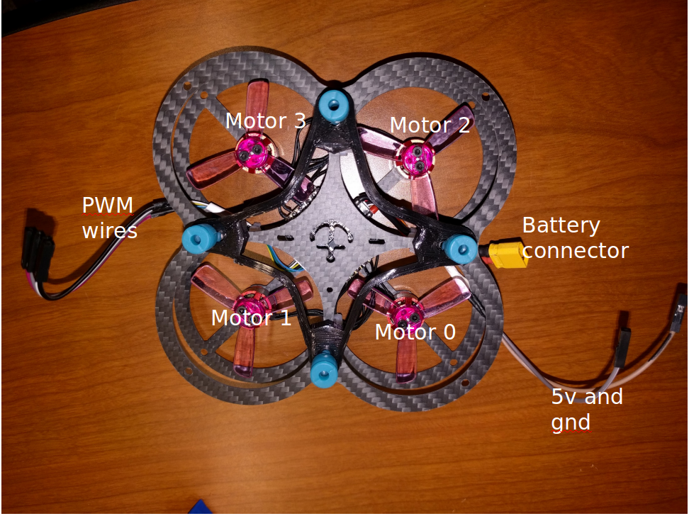

## Overview

|Components                     |Concepts|
|:------------------------------|:------|
|    MPU-9250 9-Axis IMU    |  PID Feedback Control  |
|    PWM Board  |    Embedded Microprocessors  |
|    ERC      |    Motor Control  |
|    Raspberry Pi Zero    |    Feedback Based Position and Orientation Control  |
|                               |  3D Position Data  |
||    C Programming  |
||  Group Workflow and Project Management  |

<!--
Todo:
    Gif of the copter flying in section 1
    Move chassis photo to section 2
    Gif of copter testing in section 2
    Not sure just what to put in section 3 yet
-->

## Project Summary

I undertook this project as the core of a graduate class, where I worked in a group with one other student. We assembled a small quadcopter from low cost materials and programmed flight control scripts to maintain orientation based on input from a third party video game controller. The quadcopter defaults to mixed-autonomy mode, in which it uses position data provided by a vive lighthouse to eliminate horizontal drift, while also being subject to manual control input from the user.

{: height="224px" width="300px"}

This project was valuable experience in some of the dynamics of group projects, and marked one of my first attempts to work with an embedded microprocessor. It also coincided nicely with my study of feedback control, providing me with real-world examples of concepts that would otherwise have been very theory heavy.

The project is written mostly in C. The final codebase is available on my github repository [here](https://github.com/idtx314/ME-495-Quadcopter).

## Implementation Summary
The quadcopter chassis was made of carbon fiber and steel parts, which were provided by the class. The electronics involved were an ESC board and a PWM board to regulate the motors, a Raspberry Pi Zero to control the assembly, a Lithium Polymer battery to power the drone, and a USB wireless card attached to the Pi so that we could send commands and data from a laptop over wireless SSH connection. A 9-axis IMU provided accelerometer and gyroscope data. A set of Vive sensors mounted on top of the quad allowed us to determine yaw and position in cartesian space based on signals from a lighthouse. User control was provided through a USB video game controller connected to the laptop.

Code was written in C, with instructors providing low level initialization and management functions for the motors, vive, and controller. This allowed us to place our focus on higher level operation and control of the quadcopter itself. The control script calculates pitch and roll of the quadcopter using a complementary filter of accelerometer and integrated gyroscope data. PID controllers use that information to adjust motor speed as needed to maintain a target orientation. The target orientation is set by a weighted combination of the control input from the user and the output of more feedback control loops, which use positional data provided by the Vive sensors to adjust target orientation and negate horizontal drift.

