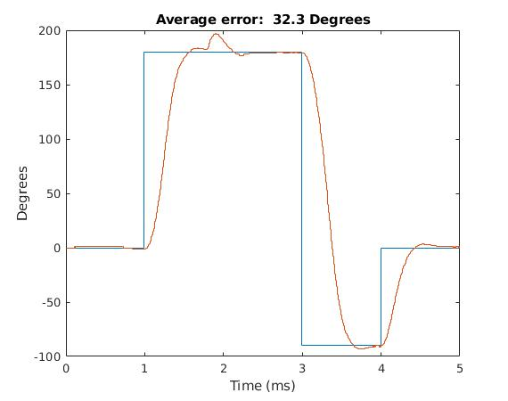
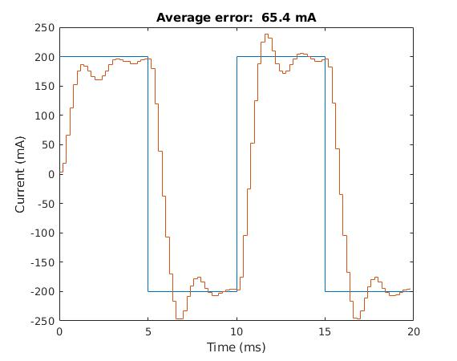

|Components                     ||Concepts|
|:------------------------------||:----------------------|
|PIC32MX795F512H   || C                   |
|NU32 breakout of PIC32             || PID Feedback Control            |
|Brushless DC Motor       || Trajectory Generation   |
|Incremental Encoder with dedicated microcontroller     || Breadboard Prototyping and Validation    |
|MAX9918 Current sensor|| Sensor Fusion |
|DRV8835 H-bridge || |

<!--
Todo:
    Final video gif for intro
    Feedback control graphs in summary

-->

## Project Overview
The objective of this class project was to use a 2-layer PID feedback control algorithm running on a microprocesser to manipulate the position of a brushless DC motor. The user interface was a matlab session which handled trajectory generation. Commands and trajectories were sent over USB to the microcontroller, which used SPI, digital, and analog I/O to interact with sensors and secondary controllers.

I was successful in achieving all objectives of this project, and I was able to find gains for the PID controllers that produced good accuracy for both step and cubic trajectory types.

A git repository containing this project is available [here](https://github.com/idtx314/PID-Motor-Control).

## Implementation Summary
The primary microcontroller for the project was a PIC32MX795F512H from microchip, mounted on an "NU32" custom breakout with integrated circuitry including a voltage regulator and a USB to UART converter chip, along with a few LEDs and buttons. The motor was brushless DC motor with a 448 line incremental encoder being read in 4x mode, but was provided without documentation or useful labeling. Characterizing the motor experimentally was a previous homework exercise. Using SPI the PIC communicated with a secondary microcontroller that came pre-configured to read the encoder on the motor. The PIC operated the motor itself using an output comparison pin and a digital I/O pin to control the duty cycle and direction bit fed to a DRV8835 H-bridge. A MAX9918 current sensor was inserted in the circuit between the motor and the H-bridge and was monitored by the PIC using an analog converter pin. The motor shaft was loaded with a fiberglass mass by direct drive to reduce the speed and increase the visibility of rotation.

Control was achieved using a 2-layer PID control algorithm. An outer PID control loop running as a 200Hz interrupt uses position data collected from the encoder and calculates the level and direction of current required to track the reference trajectory. 

{: height="300px" width="380px"}

An inner PI control loop running as a 5KHz interrupt collects current data from the current sensor and adjusts the duty cycle of a 20KHz PWM wave being generated by the PIC's output compare pin, as well as the value of the direction control bit. 
The current control interrupt is given priority over the position control interrupt, so that the target current will not change while the current loop is already running.

{: height="300px" width="380px"}

Time dependent trajectories are generated as lists of data points by Matlab at 200 data points per second, matching the position controller update frequency. These data points are then sent to the PIC over the virtual serial port associated with the USB cable.

<!-- 
{: height="170px" width="300px"}
    -->
