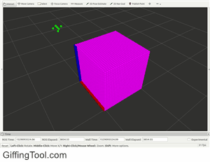

## Overview

|Components                     ||Concepts|
|:------------------------------||:-----|
|    grbl Controller     ||    Linux    |
|    Laptop  ||    Embedded Microprocessors    |
|    USB Camera      ||    ROS    |
|    X-Carve Mill       ||    Computer Vision    |
|                               ||    C++, Python    |
|||    Rviz    |
|||    GCode    |
|||    Receding Horizon Control    |

## Summary

In this project I created a ROS package to provide computer vision based feedback control for an X-Carve CNC mill. The mill was configured to operate as a pen plotter accepting time controlled x, y, and z input. The package accepts trajectories from csv files or in a variety of ROS message formats, which it then parses into gcode and transmits to the mill to be executed.
After running a trajectory for a given time period, the mill is instructed to stop operating and move the equipment away from the material. Images of the material are taken by a fixed usb camera and then processed to identify locations where the mill has drawn on the paper. This data is visualized in Rviz, and published to ROS topics in a variety of formats.  
The published data can be used to determine how well the mill has performed in executing the trajectory so far, and what alterations to the planned trajectory are necessary to achieve the desired end result of the trajectory planner.  
The motivation underlying the construction of this project is to support the ergodic trajectory research of Ahalya Prabhakar and the Neuroscience and Robotics Laboratory at Northwestern University. As part of the lab's ongoing mandate to explore neurology by implementing unusual behaviour in robotic platforms, Ahalya's research explores the remarkably life like results of using time sensitive x, y, and z trajectories to guide activities such as drawing and exploring. 

{: height="231px" width="300px"}

The project is written in C++ and Python, with ROS being used for modularity and flexibility in communication between components.
